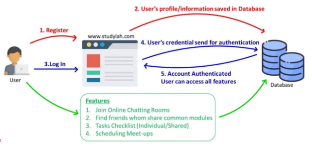

<h1>StudyLah</h1>

<h2>Motivation</h2>
In this covid semester, it is especially hard for students to connect with one another. Freshmans like us are not familiar with the school and hardly have any chance to make friends in school as the majority of the lectures and tutorials are held online.   

While watching lectures, doing tutorials and assignments, you might be stuck with a question or are confused with certain concepts, it is inconvenient having no friends to ask and having to rely on online forums or emails to professors to ask a question. Such methods also have high time delays and might result in an individual feeling lonely and helpless, hence losing the motivation to study.   

Ever felt lazy or had no motivation to study? What if there is a platform for students studying the same modules to connect and discuss?  

Thus, we wanted to create a web application, providing the students a platform to connect, expand their social circle and exchange their wisdom, helping one another in their studies, striving for better results. 

<h2>Aim</h2>
We hope to provide a platform for NUS students (and professors) to connect and forge friendship with each other through exchanging their knowledge in small study sessions.   

The provided platform will allow the user to view the modules others have taken or are currently taking for matching to form small study groups. It also helps users to schedule a date which is available to all for the study session. Additionally, it offers a common shared tasklist which records individual tasks in the group so that not only can you keep track of what you have completed but also keep your friend in check to make sure that everyone is on the same page.

<h2>User Stories</h2>
1. As an individual who wants to expand their social network within the same industry (or possibly others), I want to be able to find and forge new friendships with people of the same courses, modules or interests easily. <br<
2. As students who want to possibly study in a more efficient manner and exchange notes, I want to be able to form study groups.  
3. As a student who has questions or troubles with regards to their modules e.g. assignments, I want to be able to clarify my doubt with people who I am more comfortable with (e.g. some students prefer asking other students instead of professors).  
4. As a student who has questions regarding their courses/modules, I want to be able to get information about the modules through experiences from other students who have taken similar modules.  
5. As a student who might be busy and have trouble setting a date for meetings, I want to be able to schedule a study date without intervening with my current schedule.   
6. As a student who might be forgetful and bad at keeping track of deadlines, I want to have a tasklist that helps me to sort my assignment deadline and plan out my time. Additionally, having someone to remind of the deadlines when near due.  

<h2>Scope of Project</h2>
A web application, which includes a front-end user interface and also a back-end database to store students/application data.

<h2>How are we different from similar platforms?</h2>
<b>Telegram Chat:</b> Telegram chat groups are large in size, users might find it hard to participate or form friendships. StudyLah allows users to form smaller groups and initiate conversation easier.  
<b>Trello:</b> Corporate use trello more for tracking their employees’ projects status instead of allowing users to find teammates.

<h2>Completed Features [Milestone 1]</h2>
<h3>1. Sign Up</h3> 
<ul>
  <li>User able to create an account with his/her personal information such as full name, nus email, course information e.g.</li>
  <li>Upon creating the account, users will be redirected to the confirmation page where they will be asked to verify their email. To activate his/her account, they have to verify their account by clicking on a verification link sent to the registered nus email account. </li>
  <li>Once verification is done, the user is now a legit user of the platform. The user profile includes the following:
<ul>
  <li>Name</li>
  <li>Modules Taken</li>
  <li>User’s current course</li>
  <li>Residency Status</li>
  <li>CCAs</li>
  <li>NUS email</li>
  <li>Year of study</li>
</ul>
  </li>
</ul>
<h3>2. Log In </h3>
<ul><li>User can log in to access the web application with his/her registered email and password. Once logged in, a session is created and only certain pages can be accessed by logged in users e.g. dashboard. </li></ul>

<h2>Features to be completed [Milestones 2 & 3]</h2>
<ul>
  <li>Online Chatting Rooms/Message Box</li> 
<li>Scheduling of meet-ups
  <ul>
    <li>Helps to schedule an available date for all study partners to meet up </li>
<li>Suggests study spots in school  
-Suggest when is the peak period 
  -Suggesting/Reminding what is needed to be brought [eg. CLB need student card] </li></ul></li>
  <li>Shared CheckList</li>
-A common checklist shared with all study partners to help keep each other on track 
-Each person will have their own column to keep track 
-Allows different filters e.g. sorting of deadlines [from earliest to latest]
</ul>

<h2>Tech Stack</h2> 
1. HTML/CSS (Front-End Development)  
2. PHP 
3. Javascript  
4. MySQL (Database for Server) 
5. XAMPP (to host services like Apache & MYSQL) 

<h2>Providing Evidence of creating databases with MySQL and using PHP</h2>
We are using PHP and MySQL, to store and manage StudyLah’s data.  
When the user registers for a new account, a verification email containing the user’s unique verification token is sent to their registered email and a new sign up ID is created in the database.   
PHPMailer API is used to send this email. Once verification is done, the user is now a legit user of the platform. 
In addition, upon clicking on the “register” button, PHP will query MYSQL to compare data in its database to ensure that there is no duplication of email when registering for an account.  
When the user logs in as a registered user, MySQL compares the log-in credentials (user email and password) in order to check for authentication. Once logged in, the user session is created using PHP. 

<h2>Providing Evidence of creating front-end development for the web application</h2>
The user interfaces are designed using technology such as HTML, CSS and Javascript.   
The user-interface is designed to be user-friendly where users are able to navigate around the web application to access the different features without any hassle. CSS is used extensively to improve the user experience e.g. animation and designs. Javascript is used to trigger some of the design (e.g onclick of a button). 

<h2>Poster Link</h2>
https://drive.google.com/file/d/1rsO_akjU4PBny85V9t_oI7SxMFs8cbk3/view?usp=sharing 

<h2>Video Link </h2>
https://drive.google.com/file/d/1nMR0m85Ja2PHnsr4Wdhobj-rbLeyxmH9/view?usp=sharing 

<h2>Program Flow</h2>

<h2>Appendices</h2> 
https://docs.google.com/document/d/1HedOhXyAXjzxSAZZX1_gvAX6lX2MaZnaL71y0fT5SGY/edit?usp=sharing
